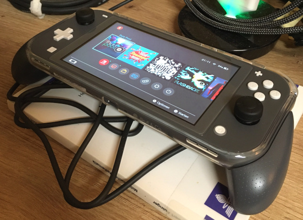

# Gaming


## History

Couple of investments and titles that I remember I played at home, friends/cousins, youth club (&#x2B73; &#x1F4BF; &#x1F4BE;  still owned download, CD or floppy/cartridge)

| Platform / Time | 1990s | 2000s | 2010s | 2020s _and Future_
|-----------------|-------|-------|-------|-------
| **Nintendo<br>GameBoy<br>(S)NES<br>SwitchLite**  | &starf; Super Mario Land 3: Wario Land <br>&starf; Duck Tales <br>&bull; Kung-Fu Master <br>&bull; Gargoyle's Quest <br>&bull; Tiny Toon Adventures 2 <br>&bull; Ferrari Grand Prix Challenge <br>&bull; Amazing Spider-Man 2 <br>&bull; Rescue of Princess Blobette <br>&bull; Cool World <br>&bull; Who Framed Roger Rabbit <br>&bull; Kirby's Dream Land <br>&bull; ... <br><br>&starf; (Super) Mario Bros. <br>&bull; Giana Sisters <br>&bull; Kid Icarus <br>&bull; NBA Jam <br>&bull; ...  | &bull; Star Fox | - | &starf; VirtuaVerse (&#x2B73;) <br>&starf; Blasphemous (&#x2B73;) <br>&starf; The Way (&#x2B73;) <br>&starf; Crysis 1+3 (&#x2B73;) <br>&starf; Wolfenstein 2 T.N.C. &#x1F4BE; <br>&starf; Witcher 3 &#x1F4BE; <br>&starf; Commandos 2 &#x1F4BE; <br>&starf; Xenoblade Chronicles 3 &#x1F4BE; <br>&starf; Hotline Miami Coll. &#x1F4BE; <br>&starf; Akane (&#x2B73;) <br>&starf; Zelda BOTW &#x1F4BE; <br>&starf; Pure Pool (&#x2B73;) <br>&starf; Gato Roboto (&#x2B73;) <br>&starf; Need for Speed H.P. (&#x2B73;) <br>&bull; Sega Ages: Sonic Hedgehog (&#x2B73;) <br>&bull; Sega Ages: Alex Kidd (&#x2B73;) <br>&bull; Metroid Dread &#x1F4BE; <br>&bull; Armed to the Gears (&#x2B73;) <br>&bull; Midnight Fight Express (&#x2B73;) <br>&bull; Hong Kong Massacre (&#x2B73;) <br>&bull; Road Redemption (&#x2B73;) <br>&bull; TT Isle of Man 2 &#x1F4BE; <br>&bull; Moto Racer 4 (&#x2B73;) <br> &bull; MotoGP 18 (&#x2B73;) <br>&bull; FIFA 19 &#x1F4BE; <br>&bull; Minit (&#x2B73;) <br>&bull; Flashback (&#x2B73;) <br>&bull; Cyber Protocol (&#x2B73;) <br>&bull; Lacuna (&#x2B73;) <br>&bull; American Fugitive (&#x2B73;) <br>&bull; Lofi Ping Pong (&#x2B73;) <br>&bull; Run Sausage Run \[mom\] (&#x2B73;) <br>&bull; The Big Journey \[kids\] (&#x2B73;) <br><br>&plus; Orzly Tempered Glas <br>&plus; ~~Orzly Grip Case [1st]~~ <br>&plus; Skull&Co. Grip Case [2nd] <br>&plus; SanDisk 256G MicroSDXC <br>&plus; HORI Slim Tough Pouch [least bulky] <br>&plus; HEIYING 16 Cartridges Box
| **Amstrad CPC**     | &bull; Kung-Fu Master <br>&bull; Tornado Low Level <br>&bull; Winter Sports <br>&bull; Bomb Jack <br>&bull; Airwolf <br>&bull; Cyrus Chess II <br>&bull; ... | - | - | - 
| **C64**             | &bull; Last Ninja <br>&bull; Winter Games <br>&bull; ... | - | - | - 
| **Sega<br>MasterSystem<br>Megadrive<br>GameGear**   | &starf; Sonic <br>&bull; Alex Kidd <br>&bull; Ecco the Dolphin <br>&bull; Jurassic Park <br>&bull; Terminator <br>&bull; Disney's Aladdin <br>&bull; Cool Spot <br>&bull; ... | - | - | - 
| **PC**              | &starf; Mortal Combat <br>&starf; Bifi Roll Action in Hollywood <br>&starf; Wolfenstein 3D <br>&starf; Battle Arena Toshinden <br>&starf; Tomb Raider 1+2 <br>&starf; Indiana Jones Last Crusade <br>&starf; Indiana Jones Fate of Atlantis <br>&starf; Monkey Island 2 <br>&starf; Sam & Max Hit the Road <br>&starf; Full Throttle <br>&starf; Cave World Saga (H&ouml;hlenweltsaga) <br>&starf; Baphomets Fluch 2 <br>&starf; Grand Theft Auto <br>&bull; Darker <br>&bull; Shufflepuck Cafe <br>&bull; Battle Chess <br>&bull; QBASIC Gorillas <br>&bull; Dune <br>&bull; Stunts <br>&bull; Aces of the Deep <br>&bull; Virtual Pool <br>&bull; Destruction Derby <br>&bull; Carmageddon <br>&bull; Phantasmagoria <br>&bull; Half-Life <br>&bull; ... <br><br>&plus; 3dfx Voodoo Graphics Accelerator| &bull; MDK <br>&bull; Moto Racer 1 <br>&bull; Need for Speed 3 <br>&bull; Deadly Tide <br>&bull; Frogger <br>&bull; Virtua Cop <br>&bull; Star Wars Rebel Assault <br>&bull; Oddworld <br>&bull; Road Rash <br>&bull; Commandos: Behind Enemy Lines <br>&bull; Heart of Darkness <br>&bull; Crusader No Remorse <br>&bull; Beneath a Steel Sky <br>&bull; Street Figher 2 <br>&bull; Day of the Tentacle <br>&bull; MegaRace 1, 2 <br>&bull; Cyberia <br>&bull; FX Fighter <br>&bull; Bad Mojo Redux <br>&bull; Normality <br>&bull; Shellshock <br>&bull; Leisure Suit Larry <br>&bull; ... | &bull; Far Cry | - 
| **PlayStation**     | - | &bull; Tekken <br>&bull; ... | - | &bull; _Shadow of the Colossus_ <br>&bull; _Death Stranding_
| **Cloud Gaming**    | - | - | - | - 
| **Smartphone<br>Tablet** | - | - | - | - 


## Nintendo Switch Lite (Bought 2022)



### Good 

- better handheld form factor, weight ok, solid/sturdy/single unit body 
  (I don't like the large handheld mode size of the original switch; 
  it's said that the mounted joycons are wobbling (although easier to change/repair and improved with OLED model))
- silent, device-fan not noticable
- sound with and without headphones is ok
- thousands of games, AAA and indie titles, just a few "smartphone games"
- price (best handheld for the money: _Aya Neo_ nice but triple the price, _Analogue Pocket_ sexy but limited, _Steam Deck_ is a laptop)
- easy eshop ecosystem
    - rechargable credit system via cards with 15/25/50/100 Euro 
    - cards available at supermarkets or Amazon (code in email)
    - Code-entering via Switch or PC and website, active in a few seconds
	- buying games just a few clicks
- eshop downloads cope well with network errors
- dark mode
- accessoires ecosystem
	- screen protectors
	- grips
	- protective cases (do not confuse with pockets, cases often have slits for ventilation, sound, audio jack etc which can get dirty in a bag)
	- protective, enlarging thumb grips (caps) for the joysticks
	- slim vs big device pockets (backpack vs car fitted luggage?)
	- game cartridges pockets
	- (charging) stands
	- extra controllers
	- alternative buttons (requires dissambly)
	- flat, small blutooth adapters
	- ... 
- gyroscope sensor (gyro-aiming in Crysis 3)
- 3,5mm Audio-Klinkensteckerbuchse
- free re-downloads after deleting or "archiving" (deletion but game icon kept on home-screen with "download" action)
- two volume settings: with and without headphones
- repairable, not glued together
    - spare parts in online shops; whole donor boards where?
    - caution: ribbon/flex cable ends easy to break; look for small white flap to release the cable 
    - many YouTube tutorials
- not a tablet/smartphone
    - real controller haptics, I don't like touch screens
    - separate device = separate battery drain; smartphone keeps ready after gaming session   
    - optimized special purpose device, although there is a YouTube app but no Excel
- PC or TV not occupied, can play parallel
- streamlined simple UI 


### Issues

- brand image: "Nintendo is for children"
	- although many 'mature' games (deeper stories, sex and crime, blood, ...), 
		see my games list in [History section](#history);
         confuses games for children with games for children only (2 markets)
    - whatever _adult_ means when it comes to video games, since adults are expected to seek real adventures rather than just play them, though (movies/books?);
	- "family friendly", but many Games imho often adhere to childish aesthetics 
	  (early Nintendo aesthetics were cartoony too but resonated better with older ppl than the bright colors and round big-headed puppet-bodies nowadays)
	- male adult Switch-Youtubers in children's rooms, surrounded by little dolls (amiibo) and stuffed Nintendo-merch animals
	- Yakuza-devs "not cool outsiders night-creatures elite platform"
- 'spring noise' in my right analogue joystick after few days of using (new device!)
	- temporarily/regularly solved without physical disassembly:
	```	
          .-------------------.
          '-----.-------.-----'
                 \     /
                _/_____\_  <----------- 1. Lifted the small rubber dust lid with scissors, 
     #####\     /       \     /#####       there shows a hole(?) to the inside
     ###############################    2. Added WD40 non-conductive evaporating contact(!) spray
     ##########o.o.o.o.o.o##########       (others used isopropyl alcohol, 90% has less water)
     ###########o.o.o.o.o###########    3. Gave stick a good massage
     ############o.o.o.o############    4. Repeated a second time
     ###############################
	```
	[YouTube-Video by WD40 company itself](https://www.youtube.com/watch?v=I35647lHFzA)
- 'joystick drift issue' often reported (not yet my problem but seems solved the same way as spring noise)
- "game card could not be read" not yet my problem
    - "headphones trick" (shares PCB with card-reader, powering headphones sometimes changes sth. for the better)
    - no contact due to 'bent pin(s)' in the card reader, repositioning via scissors or 'pin needle' 
    (might have to disasemble switch before for easier access, pins should stand pretty high)
    ```
                       ######################
                       ######################
        ---------------------------- ########    cartridge
        \________________==========/ ########    and
                          '\ \  '\ \ ########    reader pins
                       ######################
                       ######################
    ```
    - card reader replaceable (~30 euro)
- extra screen protector needed (tempered glas)
    - avoid weak Thesa for the "hinge" installation method (gets loose when you peel off the glas foil)
- slow lagging eshop on switch device
	- small pagination steps, every time new request to server (devs usually try to avoid expensive I/O): 
		either bad choice 
		or very very real time prices, 
		or from times with less stressed servers 
		or regulatoy thing (eager loading prices)
		or just more complex than a central DB (similar to real-time bidding for single online-ads)
	- apparently stressed servers (website in browser on desktop-pc sometimes HTTP 500 error)
	- [dekudeals.com](dekudeals.com) often recommended if you want to browse and be made aware of nice deals (supports Germany too)
    - [delisted games](https://delistedgames.com/all-delisted-nintendo-switch-games/)
- high games prices (on every platform), but often good deals in eshop
	- is the device itself a losing proposition for Nintendo? 
		and the money will then be earned from the ecosystem 
		after users have invested in the platform and are on the hook?
- font sizes not optimized in many games, very small, not "responsive"
- you can't move SD cards across devices (not checked yet)
- no TV out
	- hardware actually missing for display-usb (see YouTube teardown and dissambly videos)
- retail cartridge with "internet download required" (Wolfenstein2) 
	due to Nintendo's proprietary expensive cartridge hardware with small capacity (16 GB, 32 GB) 
	vs huge filesizes for triple a titles, future?
- "Need for speed" payed, installed, tried "Autolog" servers (no longer avail?), dialog "share Nintendo account info with EA (email, birthdate, ...), [cancel], error-loop autolog/privacy-dialog
    - requires to disable WIFI (plane mode) before starting the game, so it won't try or cannot connect Autolog servers for another reason
- small internal system's permanent memory 32 GB 
	- fills quickly with eshop downloads, many games are huge (640 MB for Akane??, Blasphemous 2d-platformer 7 GB!!, Crysis 3 uses 11 GB)
	- needs extra MicroSD or MicroSDXC (with system update)
- changing cartridges lil bit hard but protection makes sense for portable system
- Nintendo support:
	- quick response but useless so far
	- could not write replies to info@nintendo.de (SMTP error, very generous IP block?)
	- support ticket links in answers lead to HTTP-404-pages
- wishlist-additions on the international Nintendo.com will not be displayed correctly on the german Nintendo.de wishlist
	(sync between device and nintendo.de works and vice versa (at least removal of games)) 
- minus-button "-" uncomfortable to reach and press
- eshop downloads take long (3-4 hours for Gigabytes-Titles)
- big power adapter (but any USB source would probably do)
- at some time you recognize the same game-engines again and again, just variants of other games
- game groups in the user UI should be accessible from home menu


