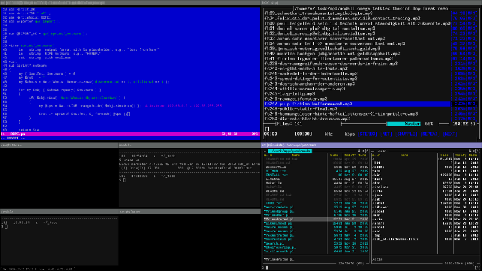

# Configuration Files

- GPL
- don't add sensitive info here, use `~/.XXX_local` files instead

## X Window System
- Xmodmap-customized US-keyboard layout with umlauts, accents, euro sign, math. symbols/notations, different quotation marks, short and long dash etc

## X Tiling Tabbed Window Manager: [Notion](https://github.com/raboof/notion)
- customized, less ugly theme (flat dark themed design)  
	
- customized, easy-to-remember key bindings (shortcuts), which are mainly centered around 
  the left/right <kbd>⊞ Win</kbd> key ('Win' like window manager) and the area around the arrow keys:
	| Action | Shortcut |
	|--------|----------|
	| Switch screens (monitor, TV in the room) | <kbd>⊞ Win</kbd>+<kbd>←</kbd><kbd>→</kbd>
	| Switch workspaces    | <kbd>⊞ Win</kbd>+<kbd>↑</kbd><kbd>↓</kbd>  or   <kbd>⊞ Win</kbd>+<kbd>Mouse Wheel</kbd> or  <kbd>Mouse Wheel</kbd> over the tabs row
	| Navigate frames      | <kbd>⊞ Win</kbd>+<kbd>Shift</kbd>+<kbd>←</kbd><kbd>→</kbd><kbd>↑</kbd><kbd>↓</kbd>  
	| Split frame (horz.)  | <kbd>⊞ Win</kbd>+(<kbd>Shift</kbd>+)<kbd>S</kbd>
	| Switch tabs          | <kbd>⊞ Win</kbd>+<kbd>Tab</kbd> or  <kbd>⊞ Win</kbd>+<kbd>\\</kbd> (right-hand Tab-key on [US-keyboards](https://i.imgur.com/aLCC3Me.png)) or  <kbd>⊞ Win</kbd>+<kbd>Backspace</kbd> (prev. tab) or  <kbd>⊞ Win</kbd>+<kbd>1</kbd>..<kbd>9</kbd>
	| Close tab (program), frame, workspace | <kbd>⊞ Win</kbd>+<kbd>End</kbd> repeatedly
	| Move tab left/right  | <kbd>⊞ Win</kbd>+<kbd>[</kbd><kbd>]</kbd>
	| Move tabs betw. frames | <kbd>⊞ Win</kbd>+<kbd>Delete</kbd> to tag tabs and   <kbd>⊞ Win</kbd>+<kbd>Insert</kbd> (here, tagging works like 'tag and switch to next tab', so you can easily tag multiple tabs in a row)
	| Program menu         | <kbd>⊞ Win</kbd>+<kbd>Enter</kbd>
	| Start terminal       | <kbd>⊞ Win</kbd>+<kbd>Space</kbd>
	| Start file explorer (mc) | <kbd>⊞ Win</kbd>+<kbd>E</kbd>	
	| Lock display (xlock) | <kbd>⊞ Win</kbd>+<kbd>Pause</kbd>
	| Invert screen (xcalib) | <kbd>⊞ Win</kbd>+<kbd>I</kbd> ([poor man's](.notion/scripts/invert.sh) dark mode)
	| Screenshot           | <kbd>⊞ Win</kbd>+<kbd>Print</kbd> ([saves](.notion/scripts/screenshot.sh) to home dir)
	| Clipboard to file (xclip) | <kbd>⊞ Win</kbd>+<kbd>P</kbd> like 'paste' ([saves](.notion/scripts/paste.sh) to home dir)
	| Shutdown             | <kbd>⊞ Win</kbd>+<kbd>Q</kbd>  or   <kbd>⊞ Win</kbd>+<kbd>F6</kbd> (60 minutes sleep timer)
	| Audio volume         | <kbd>⊞ Win</kbd>+<kbd>M</kbd> to mute  or   <kbd>⊞ Win</kbd>+<kbd>,</kbd><kbd>.</kbd> or   <kbd>⊞ Win</kbd>+<kbd>Ctrl</kbd>+<kbd>Mouse Wheel</kbd>
	| ... | ...
- [a Lua-script](https://github.com/andre-st/dotfiles/blob/master/.notion/default-session--0/cfg_sounds.lua) for notification sounds (X11 urgency hints) for whitelisted apps such as instant messengers like [Signal](https://github.com/signalapp/Signal-Desktop)
	- free beep sound files:
		[1](https://commons.wikimedia.org/wiki/File:Tone_440Hz.ogg), 
		[2](https://commons.wikimedia.org/wiki/File:Luftr%C3%BCssel.ogg), 
		[3](https://commons.wikimedia.org/wiki/File:CloudMagic_5.ogg), 
		[4](https://commons.wikimedia.org/wiki/File:ZASFX_ADSR_no_sustain.ogg), 
		[5](https://commons.wikimedia.org/wiki/File:ZASFX_ADSR_1s_release.ogg), 
		[6](https://commons.wikimedia.org/wiki/File:CommaPytha.ogg), 
		[7](https://commons.wikimedia.org/wiki/File:Sound_Effect_-_Door_Bell.ogg)

## Terminals
- my approach to long paths or command-line space is a multiline prompt, see [.exports](.exports)
  
  ([YouTube](https://www.youtube.com/watch?v=_UG-0mt2UQo))

## Web-Browser

| Mouse Gesture Action | Gesture |
|--------|---------|
| Open link in new background tab | <kbd>→</kbd> (if no middle button)
| Close current tab | <kbd>↓</kbd><kbd>→</kbd>
| Re-open previously closed tab | <kbd>↑</kbd><kbd>←</kbd>
| History back | <kbd>←</kbd>
| Scroll to page header | <kbd>↑</kbd>
| Scroll to page footer | <kbd>↓</kbd>

| Extension | Comment |
| [my own extensions](https://github.com/search?q=user%3Aandre-st+browser-extension+fork%3Atrue&type=repositories) |
| uBlock Origin | ad-blocker

| Profile | Comment |
|---------|----------|
| default |
| pentest | proxy settings, ...
| tor     | proxy settings, multiple home tabs with check.torproject.org i.a.
| banking | no extensions safe-mode, multiple home tabs with fintech sites, ...

## Vim
- todo

## PDF
- I like [Zathura](https://pwmt.org/projects/zathura/), it's a keyboard-friendly and customizable document viewer 
  with dark-mode support (recoloring) and conveniences like remembering the last reading position in a file

