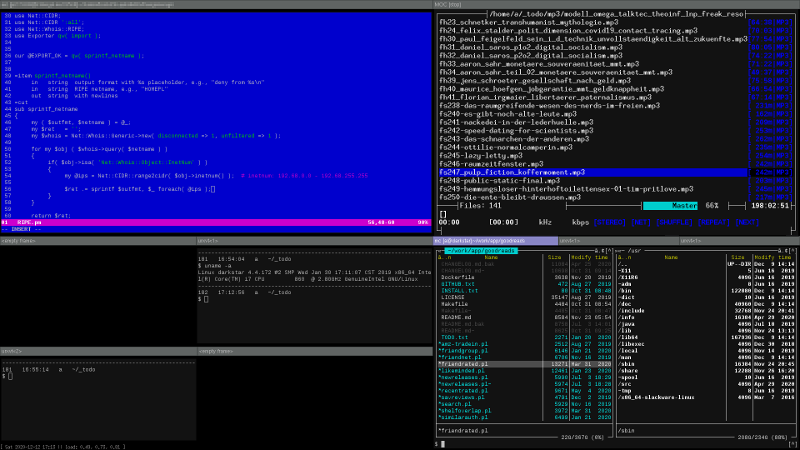
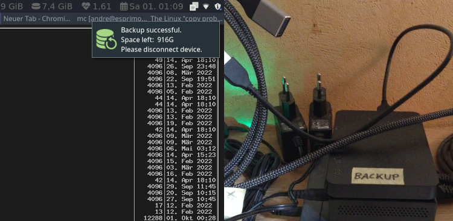
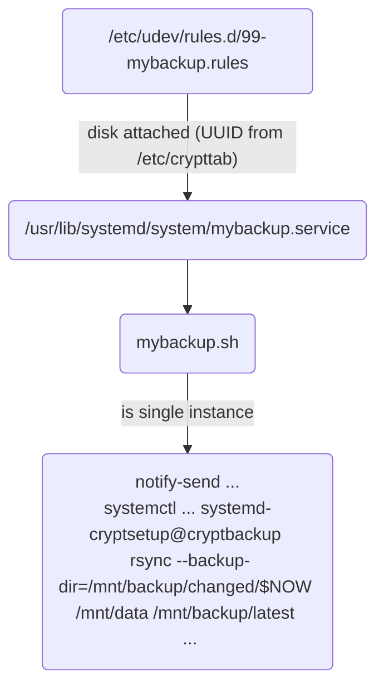

# Configuration Files & System Info

## Overview
- [Linux Distribution](#linux-distribution)
- [File System](#file-system)
- [Basic GUI Environment](#basic-gui-environment)
- [Maintenance](#maintenance)
- [Entertainment, Browser, Reader](#entertainment-browser-reader)
- [Development, Productivity](#development-productivity)
- [Printing](#printing)
- [Communication](#communication)
- [Virtualization, Emulation](#virtualization-emulation)
- [PC-Phone/Tablet Connection](#pc-phonetablet-connection)


## Linux Distribution

### 2007–2022: Slackware

At home, I use hardware that is 2–10 years behind the bleeding edge, 
good enough for my 
software dev, 
administration, 
modeling, 
documentation, 
web-surfing or 
illustration demands.
I'm not a gamer, video cutter, trader or NOC/SOC operator. 

Volkerding's Slackware Linux has been my main operating system for over 15 years (after Windows and DOS).
It allows for a very customizable scope of installation and I install it relatively lightly.
The distribution follows a [KISS](https://en.wikipedia.org/wiki/KISS_principle) philosophy—not 
that GUI helper tools hide everything 
but rather doing more with less 
and doing it explicit (less delegations or abstractions).
It uses [vanilla](https://en.wikipedia.org/wiki/Vanilla_software) packages (less issues from distro specific patches)
and BSD-style init.

Simplifying troubleshooting and customization,
in Slackware you don't have to deal with a lot of superstructure, safety nets, extra security and UI layers.
Rather you learn more about how Linux is basically put together. 
Everything is glued together with well-commented shell scripts and other text-files 
= transparent, grep-able and easy to edit.
Even what looks like larger ncurses tools are usually just shell scripts 
that call the [dialog](https://linuxcommand.org/lc3_adv_dialog.php) binary.  


### 2022–today: Manjaro-i3-Minimal

My primary computer is not a PC-tower anymore but a Fujitsu Esprimo mini-PC (∅5–15W) 
because it runs ∅17h/7d in my ~~mid-pandemic pre-energy-war~~ post-pandemic energy-war German home office 
and I want to reduce electricity cost. 
The eliminated computer noise is a nice plus.
Except for backups, no hard disk drives are running there anymore, only 16 GB + 1 TB semiconductor memory, 
which noticeably accelerate the entire system in everyday work 
beyond any processor improvement.

When I ran into NVMe-UEFI-ELiLo issues during the Slackware installation, 
I tried other modern distributions 
to find out if it's a fundamental problem 
or what they do differently. 
But the out-of-the-box experience 
and the opportunity to re-familiarize yourself with more widely adopted concepts was seductive, 
and I will give _Manjaro-i3-Minimal_ a longer try, now.


## File-System

All partitions are _dm-crypt/LUKS_ encrypted, 
with some partitions having different keys and only 
[opened when needed](slackware-2022/usr/local/bin/cryptopen). 
The partition for my home directory and _/var_ have the same key as the root partition 
(put in _/etc/crypttab_ so that I only have to enter it once for all of them when booting).

Before UEFI _Secure Boot_, 
I protected the unencrypted boot partition (kernel, initrd, lilo) 
against tampering by carrying it around on a bootable 
sturdy USB stick.
Aside from the fact that I don't need that paranoia level 
(on par with hardware keyloggers and spycams), 
it also felt a bit fragile 
and would theoretically make it possible to bring malicious code directly to my computer _via myself_ 
in the (unlikely) event that I lose sight of the stick for a longer time.
Thus, security would be degraded rather than improved.

I used to use a logical volume manager. 
Today I leave it out for reasons of operation/troubleshooting simplicity 
(HW-layer, LVM-layer, dmcrypt-layer, FS-layer, ...)

My hard drives are conservatively formatted with ext3/4 – 
stable, widely used, backward compatible, and will continue to exist for a while.
Data usually live longer than their applications and computers.


## Basic GUI Environment

### 2007–2022: Ion3/[Notion](https://github.com/raboof/notion) Tiling Window Manager



I used to have two monitors for a long time. 
Now there is only a single 24-inch office EIZO monitor.
I think it helps me to focus and maybe reduce electricity bills (∅10 W).
My larger television is connected as a second output device, 
but I usually don't use it for work. 

Dark flat design theme (so that I don't look into a bright lamp for many hours), 
no full-blown desktop environment, 
preferably keyboard-friendly and tidy text-based UI.
A TUI usually lacks _decorative animations_ or "seductive details" 
that help with the first impression of a product or "software sympathy". 
Though, it might show _informative animations_ 
that communicate functionality or responsiveness.

A background image would indicate bad use of my screen estate.

I use _workspaces_ a lot 
as they reduce window confusion, 
reduce the distance to reach specific windows
and provide different tiles layouts used earlier (Notion feature).

_Notion_ is a fork of the discontinued _Ion3_ tiling tabbed static window manager (Not-Ion) 
that I was using the years before 
and it differs from other _dynamic_ tiling window managers 
in that it does not automatically resize and move around tiles 
as windows appear and disappear.

A "dumb" static distraction-free _100% predictable_ user interface 
(as opposed to a "smart" UI with 1% uncertainty) 
facilitates _habit formation_ and _semi-automatic execution_ 
(so called "unconscious competence"): 
You are faster and have your mind free for other things.
Conversely, even a small amount of unpredictability 
demands disproportionately more attention for fear of mistakes.  
No interface &gt; static interface &gt; smart interface

Slackware runs the _Xorg_ display server:
- NVIDIA-Linux-x86\_64-390.116.run
- todo: 
	either start permanently via runlevel 5 in `/etc/inittab` 
	(and temporarily stay in the console at start by adding a runlevel number at the lilo boot prompt)
	versus calling `startx` in `.bash_profile` for the _first_ tty 
	(and temporarily stay in the console at start by switching to a different tty via <kbd>Alt</kbd>+<kbd>F2</kbd> at login)
	versus typing `startx` everytime after login in an already open console


### 2022–today: i3 Tiling Window Manager


- I'm fine with i3, but I felt I was faster and less mentally involved with Notion; maybe a matter of habit, I've used Ion and Notion for years
- todo
- rofi (dmenu replacement)


### Fonts

- todo


### Input Devices & Bindings

- full-size mechanical keyboard (Cherry MX Blue switches) 
- free-spinning scroll wheel mouse
- I keep thinking about foot pedals, but I haven't come up with a really good use case (push-to-talk, potentiometer to zoom in/out of Gimp, ?)
- voice interfaces would contribute to noise pollution
- touch interfaces lack tactile feedback (sound/vibration isn't same) and fingers hide part of the screen; apart from smartphones, the hand position is unnatural
- [Xmodmap-customized US-keyboard layout](manjaro/home/andre/.Xmodmap-cherry-g803000lsceu0) with umlauts, accents, euro sign, math. symbols/notations, different quotation marks, short and long dash etc.
I have mapped the first level of the numeric keypad to function keys, thus shorter distances from the cursor keys to the function keys with the right hand, e.g. delete (F8) in the Midnight Commander.
- window-'focus follows mouse' mode (perfect for tiling WM, not so for stacking/floating WM)


Customized key-bindings (Shortcuts), easy-to-remember, centered around left/right "window manager" <kbd>⊞ Win</kbd> key and arrow keys area on a full-size or tenkeyless keyboard:  

| WM Action                 | Shortcut Notion | Shortcut\_i3_(2022\_today)
|---------------------------|-----------------|------------------------
| Switch screens (monitor, TV in the room) | <kbd>⊞ Win</kbd>+<kbd>←</kbd><kbd>→</kbd>                            |  <kbd>⊞ Win</kbd>+<kbd>0</kbd> repeatedly
| Switch workspaces         | <kbd>⊞ Win</kbd>+<kbd>↑</kbd><kbd>↓</kbd>  or<br>  <kbd>⊞ Win</kbd>+<kbd>Mouse Wheel</kbd> or<br> <kbd>Mouse Wheel</kbd> over the tabs row  |  <kbd>⊞ Win</kbd>+<kbd>Tab</kbd> <br> <kbd>⊞ Win</kbd>+<kbd>\\</kbd> <br> <kbd>⊞ Win</kbd>+<kbd>BackSpace</kbd> reversed
| Navigate frames           | <kbd>⊞ Win</kbd>+<kbd>Shift</kbd>+<kbd>←</kbd><kbd>→</kbd><kbd>↑</kbd><kbd>↓</kbd>  |  
| Split frame (horz.)       | <kbd>⊞ Win</kbd>+(<kbd>Shift</kbd>+)<kbd>S</kbd>                                    |  <kbd>⊞ Win</kbd>+(<kbd>Shift</kbd>+)<kbd>S</kbd>
| Switch tabs               | <kbd>⊞ Win</kbd>+<kbd>Tab</kbd> or<br> <kbd>⊞ Win</kbd>+<kbd>\\</kbd> (right-hand Tab-key on [US-keyboards](https://i.imgur.com/aLCC3Me.png)) or<br> <kbd>⊞ Win</kbd>+<kbd>Backspace</kbd> (prev. tab) or<br> <kbd>⊞ Win</kbd>+<kbd>1</kbd>..<kbd>9</kbd>  |  <kbd>⊞ Win</kbd>+<kbd>↑</kbd><kbd>↓</kbd><kbd>←</kbd><kbd>→</kbd>
| Move tab left/right       | <kbd>⊞ Win</kbd>+<kbd>[</kbd><kbd>]</kbd>                                           |  <kbd>⊞ Win</kbd>+<kbd>Shift</kbd>+<kbd>↑</kbd><kbd>↓</kbd><kbd>←</kbd><kbd>→</kbd>
| Move tabs betw. frames    | <kbd>⊞ Win</kbd>+<kbd>Delete</kbd> to tag tabs and<br>  <kbd>⊞ Win</kbd>+<kbd>Insert</kbd> (here, tagging works like 'tag and switch to next tab', so you can easily tag multiple tabs in a row)  |
| Close tab (program), frame, workspace | <kbd>⊞ Win</kbd>+<kbd>End</kbd> repeatedly                              |  <kbd>⊞ Win</kbd>+<kbd>End</kbd>
| Program menu              | <kbd>⊞ Win</kbd>+<kbd>Enter</kbd>                                                   |  <kbd>⊞ Win</kbd>+<kbd>Enter</kbd>
| Terminal                  | <kbd>⊞ Win</kbd>+<kbd>Space</kbd> <br> <kbd>Ctrl</kbd>+<kbd>↑</kbd><kbd>↓</kbd> adjusts font size (see [Terminals section](#terminal-rxvt-unicode)) <br> <kbd>Ctrl</kbd>+<kbd>←</kbd><kbd>→</kbd> moves cursor by word <br> <kbd>Ctrl</kbd>+<kbd>A</kbd><kbd>E</kbd> moves cursor to line start/end  |  <kbd>⊞ Win</kbd>+<kbd>Space</kbd>
| Start file explorer (mc)  | <kbd>⊞ Win</kbd>+<kbd>E</kbd>                                                       |  <kbd>⊞ Win</kbd>+<kbd>E</kbd>
| View process list (htop)  | <kbd>⊞ Win</kbd>+<kbd>H</kbd>	                                                  |
| Lock display (xlock)      | <kbd>⊞ Win</kbd>+<kbd>Pause</kbd>                                                   |  <kbd>⊞ Win</kbd>+<kbd>Pause</kbd>
| Invert screen (xcalib)    | <kbd>⊞ Win</kbd>+<kbd>I</kbd> ([poor man's](slackware-2022/home/a/.notion/scripts/invert.sh) dark mode)   |
| Screenshot                | <kbd>⊞ Win</kbd>+<kbd>Print</kbd> ([saves](slackware-2022/home/a/.notion/scripts/screenshot.sh) to home dir)  |  <kbd>Print</kbd> screen <br> <kbd>Shift</kbd>+<kbd>Print</kbd> screen 5sec <br> <kbd>⊞ Win</kbd>+<kbd>Print</kbd> window only
| Clipboard to file (xclip) | <kbd>⊞ Win</kbd>+<kbd>P</kbd> like 'paste' ([saves](slackware-2022/home/a/.notion/scripts/paste.sh) to home dir)  |
| Shutdown                  | <kbd>⊞ Win</kbd>+<kbd>Q</kbd>  or<br>  <kbd>⊞ Win</kbd>+<kbd>F6</kbd> (60 minutes sleep timer)  |
| Audio volume              | <kbd>⊞ Win</kbd>+<kbd>M</kbd> to mute  or<br>  <kbd>⊞ Win</kbd>+<kbd>,</kbd><kbd>.</kbd> or<br>  <kbd>⊞ Win</kbd>+<kbd>Ctrl</kbd>+<kbd>Mouse Wheel</kbd>  |


### Terminal: _rxvt-unicode_

My approach to long paths or command-line space is a multiline prompt, see [.prompt](manjaro/home/andre/.prompt)
```
------------------------------------------------------------------------ ...
70   13:08:09   andre   ~/source/private/app
$ cd irssi
------------------------------------------------------------------------ ...
71   13:08:15   andre   ~/source/private/app/irssi (master)
$ ls -la
insgesamt 144
-rw-------  1 andre datausers 35147  3. Jul 2018  LICENSE
drwx------  3 andre datausers  4096 14. Feb 2022  .
drwx------ 29 andre datausers  4096 21. Mär 2022  ..
drwx------  8 andre datausers  4096  3. Okt 2019  .git
-rw-------  1 andre datausers    30  4. Apr 2018  .gitignore
-rw-------  1 andre datausers    48  4. Apr 2018  AUTHORS.md
-rw-------  1 andre datausers  2897  2. Sep 2018  README.md
-rw-------  1 andre datausers 25194 27. Dez 2017  jalso.ods
-rw-------  1 andre datausers  9647  2. Sep 2018  jalso.pl
-rw-------  1 andre datausers  4573  4. Aug 2011  osd.a.pl
-rw-------  1 andre datausers  5339  2. Sep 2018  osd.pl
-rw-------  1 andre datausers  5435 27. Dez 2017  jalso-20101127.png
-rw-------  1 andre datausers 15002  3. Jul 2018  osd-20110213.png
-rw-------  1 andre datausers   409 17. Mai 2018  GITHUB.txt
------------------------------------------------------------------------ ...
72   13:08:16   andre   ~/source/private/app/irssi (master)
$
```
([YouTube](https://www.youtube.com/watch?v=_UG-0mt2UQo))

The font size of the current terminal can be changed via a keyboard shortcut, 
without having to exit the terminal: 
see [urxvt-font-size extension](https://github.com/majutsushi/urxvt-font-size) for rxvt-unicode 
and my [manjaro/home/andre/.Xresources](manjaro/home/andre/.Xresources) file.


## Maintenance

### System Exploration, Troubleshooting

- [Midgnight Commander](https://github.com/MidnightCommander/mc): 
	Loved the Norton Commander back in the 90s 
	and the Midnight Commander has been with me since my early Linux experience. 
	I use it all the time for browsing and organizing file directories. 
	Important settings: "Lynx-like motion" allows a quick change to the parent directory from any position via the Left arrow key; 
	combined with shell directory-[aliases](manjaro/home/andre/.alias) 
	such as `cdd` (cd ~/downloads), `cde` (cd /etc) and so on. 
	Alternatively (<kbd>Alt</kbd>-<kbd>T</kbd>) 3 columns "brief listing format" with changing to parent dirs via <kbd>Ctrl</kbd>-<kbd>PgUp</kbd> 
	or a custom key via `/etc/mc/mc.keymap:CdParentSmart`; hide menu and tip bars
- [sysdig](https://github.com/draios/sysdig), csysdig:
	intuitive integration of strace + tcpdump + htop + iftop + lsof + ... (the founder was co-creator of WireShark too)
- [lnav](https://lnav.org/features):
	merges multiple log files in one view for timeline analysis (coherent events), 
	automatically marks and jumps to error words, histogram, 
	logfile format detection, sqlite-queries (e.g. count IPs or requests per day + ANSI bar chart), 
	many more
- stress / stress-ng: 
	stress-test system, e.g., increase CPU temperature to check system's thermal management
- [mtr / mtr-tiny](https://github.com/traviscross/mtr): 
	traceroute (devices in the path between sender and receiver) + ping (packet loss, round trip time) to diagnose bad links
- nmap
- [xdiskusage](https://github.com/andre-st/xdiskusage):
	few deps and a treemap-esque display which is easier to read than the usual nested treemaps
- Wireshark (or Termshark-TUI)
- use of statistics or logic software (correlation, plots, ...)
- `dig` (dnsutils) is `drill` (ldns) now
- `netstat` (net-tools) is `ss` (iproute2) now


### Backups, Recovery, Continuity: _rsync_



Basically, it is set up like this:


- **Convenient:** Backup auto-starts by attaching a known disk drive (via _udev_ device manager).
  Convenience ensures that I don't skip backups due to lack of time or laziness.
  All important data is on a separate partition _/mnt/data_, 
  with _changes_ being fully synchronized onto the backup 
  at acceptable total running times (minutes)
- **Offline:** I keep backup disks detached 
  so that they cannot be mounted and affected by ransomware. 
  Permanently attached drives are not a backup but extended storage
- **Encrypted:** dm-crypt/LUKS makes offsite backups less risky.
  Currently, I don't have offsite backups in case of fire etc, though 
  (neither cloud storage backups).
  An encrypted main system with unencrypted backups would be pointless, too.
  Keyfile in _/etc/keys/_.
- **Visible:** The backup process is shown to me with a small permanent notification (_dunst_) 
  at the top right edge of the desktop GUI.
  It also tells me when I can detach the drive again
- **Forever Reverse Incremental Backup:**
  The most recent restore point is always a full backup, 
  allowing fast recovery if your latest backup isn't already corrupted. 
  In contrast to forward incremental backups, 
  it is easier to delete old backups to make room for new backups, too.
- **Simple**: No special block-level patching magic and no extra-repository to corrupt,
  tools usually pre-installed

- recovery todo


### Patching, Software Management

- todo
- sbopkg

Downgrading packages in Manjaro/Arch:
```sh
$ pamac install downgrade
$ DOWNGRADE_FROM_ALA=1 downgrade <PKGNAME>  
	# Menu opens...
	# ...prefer cached versions over ALA due to missing Manjaro customizations
```
Find package for tool:
```sh
$ pkgfile -v -b <TOOLNAME>
```


### Power and Thermal Management

- todo
- todo: manual fan full blow
- [h264ify](https://chrome.google.com/webstore/detail/h264ify/aleakchihdccplidncghkekgioiakgal?hl=en) browser plugin
	- check: right-click on YouTube-video, click "stats for nerds", look for codec _avc_ (= h264)
	- hardware accelerated video via Chromium command line options `--use-gl=desktop --ignore-gpu-blocklist --enable-features=VaapiVideoDecoder` (edit desktop-file), 
		check via `chrome://gpu` (video decode: hw accelerated) and `$ vainfo` without errors (I needed the _intel-media-driver_ package)
	- my mini PC actually produces moderate temperatures (Ø60 °C), also no problem with downloaded HD videos - unless I play them directly from YouTube w/o hw-acc (83 °C)


### Security
- todo
- patching (see above)
- ad-blocker (_Malvertising_ can also affect users who never click on ads);
	I currently only use it [in the browser](#web-browser). 
	Host-file-based blocks or Pi-hole, however,
	would also protect other (less secure) programs and devices that embed ads
- KeePassXC for time-based one-time password (TOTP) generation (system time sync required), 
  zbarimg for QR code scanning


### Time Synchronization
Manjaro: 
```sh
$ systemctl status ntpd.service               # was disabled
$ systemctl status systemd-timesyncd.service  # prefered over ntpd.service
$ systemctl enable --now systemd-timesyncd.service
```


## Entertainment, Browser, Reader

### Media

- [nsxiv](https://github.com/nsxiv/nsxiv) image viewer:
	With dark mode ([.Xresources](.Xresources)), adjusted `thumb_sizes[]` and `THUMB_SIZE` in config.def.h;
	[keys configured](.config/sxiv/exec/key-handler) so that I can go through an image collection (thumbs)
	and either move individual images to (automatically created) subfolders such as "\_trash" and "\_wrong", 
	or symlink them from a "\_selected" subfolder for later revisitation;
	I often use directories with a leading underscore to make them stand out as "meta" dirs and to let them sort to the top in a file list.
- [mpv](https://github.com/mpv-player/mpv) video player (called via mc)
- youtube-dl to download video from YouTube and other websites; 
	for example, it downloads _blob:_ videos using the m3u8-URL found via browser's devtools network activity view (F12)
- [Music on Console](https://en.wikipedia.org/wiki/Music_on_Console) audio player:
	My time of listening differs significantly from the time of downloading, 
	so many unheard podcasts etc accumulate.
	MOC function keys can be configured to run any program:

	- <kbd>F4</kbd> [moves audios &gt; 14 minutes](https://gist.github.com/andre-st/5d17372e6d209d792860db2636665bbd) 
		to `~/Downloads/mp3/[F4]-longer/` 
		because I want to separate short audios from long ones (and MOC cannot sort by audio length)
	- <kbd>F6</kbd> moves heard, archive-worthy audios 
		to `~/Downloads/mp3/[F6]-archive/` 
		until I have time to sort them better
	- <kbd>F8</kbd> deletes file

	I don't use metadata-based media libraries but am 1:1 with the file system.
	Proper filenames, unlike metadata containers, 
	can be viewed, searched, sorted etc with almost any program in any context (e.g. SFTP).
	I've also tried the well-made [cmus](https://github.com/cmus/cmus) and a couple of MPD clients, 
	but I work more fluently with MOC
- [EasyEffects](https://github.com/wwmm/easyeffects) sound-quality tool:
	Manjaro (today): Pipewire + EasyEffects (formerly PulseEffects) + EQ presets, volume normalizer etc somewhere from GitHub (todo)
	(earlier on Slackware: PulseAudio Multiband EQ).
	I used to have an old Panasonic audio system (RX-CS780) connected to the computer. 
	Today only the speakers exist, which I then connected to the computer using a _Fosi Audio_ mini power amplifier (40 Euro). 
	Maybe should have bought the one with EQ, but software EQ is fine too.
- [PC-Phone/Tablet Connection](#pc-phonetablet-connection) section in this file details my media use on mobile devices


### Web Browser

| Browser Action | Mouse Gesture |
|----------------|---------------|
| Open link in new background tab | → (if no middle button)
| Close current tab | ⤷
| Re-open previously closed tab | ↰
| History back | ←
| Scroll to page header | ↑
| Scroll to page footer | ↓


| Browser Extension | Comment |
|-------------------|---------|
| [my own extensions](https://github.com/search?q=user%3Aandre-st+browser-extension+fork%3Atrue&type=repositories) | tabs mgr., mouse gestures, Amazon, Javascript/CSS injection, ...
| [Dark Reader](https://github.com/darkreader/darkreader) | dark mode on every website
| [uBlock Origin](https://github.com/gorhill/uBlock) | ad-blocker
| [Super Simple Highlighter](https://github.com/dexterouslogic/super-simple-highlighter) | color-mark text on a website (set perms to allow wesbite changes on icon-click only)
| GoFullPage | screenshot of an entire webpage


| Browser Profile | Comment |
|-----------------|---------|
| default         |
| pentest         | proxy settings, ...
| tor             | proxy settings, multiple home tabs with check.torproject.org i.a.
| banking         | no extensions safe-mode, multiple home tabs with fintech sites, ...
| private         | 


### Gaming

In my childhood and adolescence I played a lot of video games, 
sometimes on my own consoles and PCs, 
sometimes with friends or in a youth club. 
But then there was a long PC phase without any games and I keep it that way. 
By the time I turned 40, I'd still bought a handheld console again 
for when I feel like turning off all other devices
and clearing my mind of a thousand thoughts by concentrating on one fun thing.


| Platform / Time | 1990s | 2000s | 2010s | 2020s |
|-----------------|-------|-------|-------|-------|
| Gameboy         | Super Mario Land 3: Wario Land <br> Kung-Fu Master <br> Gargoyle's Quest <br> Duck Tales <br> Tiny Toon Adventures 2 <br> Ferrari Grand Prix Challenge <br> Amazing Spider-Man 2 <br> Rescue of Princess Blobette <br> Cool World <br> Who Framed Roger Rabbit <br> Kirby's Dream Land | - | - | -
| Amstrad CPC     | Kung-Fu Master <br> Tornado Low Level <br> Winter Sports <br> Bomb Jack <br> Airwolf <br> Cyrus Chess II | - | - | -
| (S)NES          | Giana Sisters <br> (Super) Mario Bros. <br> Kid Icarus <br> Arcade NBA Jam ... | Star Fox | - | -
| C64             | Last Ninja <br> ... | - | - | -
| Sega MS/MD/GG   | Ecco the Dolphin <br> Sonic <br> Jurassic Park <br> Terminator <br> ... | - | - | -
| PC              | Mortal Combat <br> Darker <br> Shufflepuck Cafe <br> Battle Chess <br> QBASIC Gorillas <br> Bifi Roll Action in Hollywood <br> Dune <br> Stunts <br> Wolfenstein 3D <br> Battle Arena Toshinden <br> Indiana Jones Last Crusade <br> Indiana Jones Fate of Atlantis <br> Monkey Island 2 <br> Sam & Max Hit the Road <br> Full Throttle <br> Aces of the Deep <br> Tomb Raider 1, 2<br> Virtual Pool <br> Destruction Derby <br> Carmageddon <br> Phantasmagoria <br> Half-Life <br> ... | MDK <br> Cave World Saga (H&ouml;hlenweltsaga) <br> Moto Racer 1 <br> Need for Speed 3 <br> Baphomets Fluch 2 <br> Deadly Tide <br> Frogger <br> Virtua Cop <br> Grand Theft Auto <br> Star Wars Rebel Assault <br> Oddworld <br> Road Rash <br> Commandos: Behind Enemy Lines <br> Heart of Darkness <br> Crusader No Remorse <br> Beneath a Steel Sky <br> Street Figher 2 <br> Day of the Tentacle <br> MagaRace 1, 2 <br> Cyberia <br> FX Fighter <br> Bad Mojo Redux <br> Normality <br> Shellshock <br> Leisure Suit Larry <br> ... | - | -
| PlayStation     | - | ... | - | -
| Switch Lite     | - | - | - | VirtuaVerse <br> Blasphemous <br> The Way <br> Metroid Dread <br> TT Isle of Man 2 <br> Zelda Breath of the Wild


### Other

- [Zathura](https://pwmt.org/projects/zathura/): keyboard-friendly, dark-mode, fast PDF-reader
- pdfgrep: grep PDF files ([ripgrep-all](https://github.com/phiresky/ripgrep-all) probably faster)
- [commafeed.com](https://www.commafeed.com): RSS-reader for blogs, news sites, podcasts, ...


## Development, Productivity
- todo
- Editing: vim, vimdiff, vim-plugins, edir, ...
- Statistics, Graphs: ~~[RStudio](https://github.com/rstudio/rstudio)~~ NVim-R
- Box-and-line diagrams: [UMLet](https://github.com/umlet/umlet) for many years (keyboard-friendly, non-bloat, ...) 
	- Network diagrams, high level software designs / architectures, book summaries (semi-formal sketchnoting)
- Vector images: [Inkscape](https://github.com/inkscape/inkscape)
- Pixel images: [Gimp](https://github.com/GNOME/gimp)
- ASCII/ANSI art: [New Draw](https://github.com/andre-st/newdraw)
- 3D/CAD:
	[OpenSCAD](https://github.com/openscad/openscad), 
	[FreeCAD](https://github.com/FreeCAD) w/ Assembly4 + Fasteners + gmsh for finite element analysis
	(in Manjaro I use the AppImage (v20) because components of the official repo version do not match (v19 VTK9 problem))
- Office: Markdown / Htmlcssjs &gt; Google Docs (collaborative) &gt; LibreOffice (not installed) &gt; MS Office on Windows; 
	`$ antiword ms.doc | vim -`
- Video editing / Streaming: FFmpeg suite
- Git/GitHub: `git gui` is handy for staging patches
- Presentations: todo
- Networking: vpnc (Cisco VPN client), OpenSSH, Midnight Commander's (S)FTP virtual file system, ...
 


## Printing

- todo, CUPS


## Communication

I prefer emails and upfront arranged phone calls.

- email: todo
- Instant Messenger: **none**
	- in the past: Signal [without a smartphone](https://ctrl.alt.coop/en/post/signal-without-a-smartphone), Pidgin (Jabber/XMPP), ICQ
- Chat rooms: IRC irssi, general talk or questions, 
	with [my extensions](https://github.com/andre-st/irssi-scripts)
- Video conferencing + Screen sharing: [Jitsi](https://github.com/jitsi), [Teamviewer](https://www.teamviewer.com/)
- Collaborative editing: [Etherpad](https://github.com/ether/etherpad-lite) or Google Docs
- Notifications: everything as status email


## Virtualization, Emulation
- [QEMU](https://github.com/qemu/qemu), virt-manager, dosbox
- one of the free Microsoft Windows [IE/Edge VM images](https://developer.microsoft.com/en-us/microsoft-edge/tools/vms/) (no installation needed)
- somewhat outdated but free macOS image (High Sierra, ...)


## PC-Phone/Tablet Connection

- [darkhttpd](https://github.com/emikulic/darkhttpd) light single-binary web-server as temporary "media server":
	Mobile web-browsers can pseudo-stream videos and audios via HTTProtocol (progressive download playback).
	Darkhttpd supports _HTTP range requests_ (to skip through a video or mp3) 
	and supports _automatic HTML directory listings_ so you don't have to enter file paths on the client.
	With these things I don't need separate, full blown media server software for now.
- todo: android scrcpy


